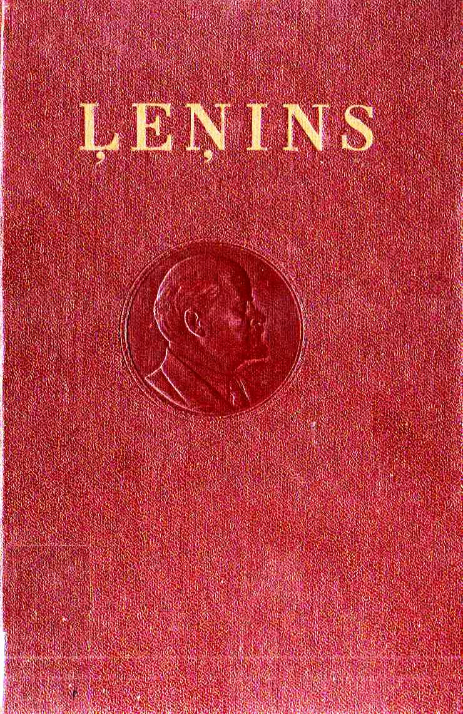

# Ļeņina kopotu rakstu 4. izdevuma 1. sējums

<h2>Saturs</h2>

    <ul>
        <li><a href="./000G.jpg">Priekšvārds ceturtajam izdevumam</a></li>
        <li><a href="./000L-000M.jpg">Priekšvārds pirmajam izdevumam</a></li>
        <li><a href="./001.jpg">Jaunas saimnieciskās kustības zemnieku dzīvē <i>(Sakarā ar V. Pļehanova grāmatu "Dienvidkrievijas zemnieku saimniecība")</i></a></li>
        <li><a href="./057.jpg">Sakarā ar tā saucamo jautājumu par tirgiem</a></li>
        <li><a href="./107.jpg">Kas tie tādi "tautas draugi" un kā viņi karo pret sociāldemokrātiem? <i>(Atbilde uz žurnāla "Russkoje Bogatstvo" rakstiem pret marksistiem)</i></a></li>
        <li><a href="./107.jpg">Narodņicisma ekonomiskais saturs un tā kritika Strūves kunga grāmatā (Marksisma atspoguļojums buržuāziskā Kritiskās piezīmes jautājumā par Krievijas ekonomisko attīstību". Sanktpēterb., 1894. g.)</i></a></li>
        <li><a href="./457.jpg">Piezīmes</a></li>
        <li><a href="./474-475.jpg">V. I. Ļeņina dzīves un darbības dati</a></li>
    </ul>

## Ilustrācijas
- [V. I. Ļeņina portrets (1918. g.)](./00B.jpg)
- [V. I. Ļeņina portrets (1890─1891)](./138-139.jpg)
- [V. I. Ļeņina rokraksta „Jaunas saimnieciskās kustības zemnieku dzīvē“ pirmā lappuse (1893. g.)](./002.jpg)
- [V. I. Ļeņina rokraksta „Sakarā ar tā saucamo jautājumu par tirgiem“ pirmā lappuse (1893. g.)](./059.jpg)
- [V. I. Ļeņina rokraksta Sakarā ar tā saucamo jautājumu par tirgiem“ pēdējā lappuse (1893. g.)](./104-105.jpg)
- [V. I. Ļeņina grāmatas Kas tie tādi "tautas draugi" un kā viņi karo pret sociāldemokrātiem?“ Ⅲ izlaiduma hektografētā izdevuma vāks (1894. g.)](./178.jpg)
- [V. I. Ļeņina grāmatas „Kas tie tādi "tautas draugi" un kā viņi karo pret sociāldemokrātiem?“ Ⅲ izlaiduma hektografētā izdevuma pēdējā lappuse (1894. g.)](./268.jpg)
- [Tā rakstu krājuma titullapa, kurā bija iespiests V. I. Ļeņina darbs „Narodņicisma ekonomiskais saturs un tā kritika Strūves kunga grāmatā“. (1895. g.)](./301.jpg)

## Oriģinālā grāmatas tehniskā specifikācija (pēdējā lappuse)

> JT 01360. Parakstīta iespiešanai 1954. g. 7. septembrī. 
> Metiens 50 000 eks. (21 000─25 000). Papīra formats 
> 52×83/16, 32,0 fiz. iespiedl., 26,24 uzsk. iespiedl., 
> 28,0 izdevn. 1. Latvijas Valsts izdevniecībā, Rīgā, 
> Padomju bulvarī 24. izdevn. Nr. 6953-P266. Iespiesta 
> LPRRT Paraugtipografijā, Rīgā, Puškina ielā 12. 
> Maksā 6 rbļ. 50 kap.

## Citas piezīmes
Attēla (`*.jpg` vai `*.png`) nosaukums ir tās lapaspuses, kuras ir redzamas tajā. Failu nosaukumi, kas sākas ar `000X`, kur `X` ir bāzes latīņu alfabēta burts, ietver grāmatas priekšvārdu.